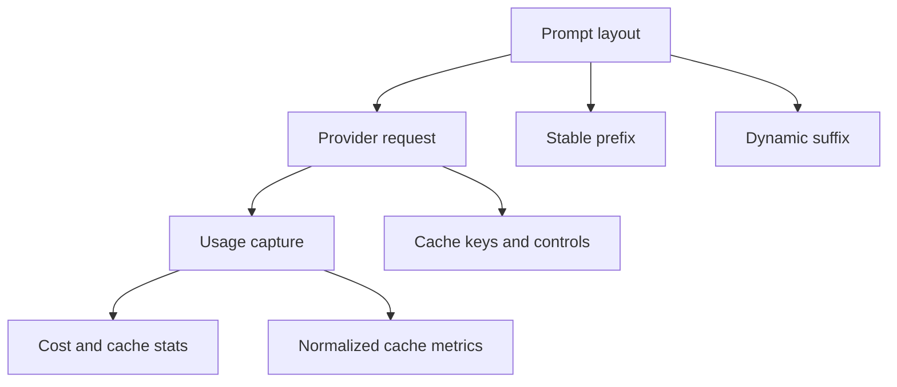

# Plano De Otimização De Prompt Cache

## Documentos Arquiteturais Obrigatórios

A implementação deve seguir esta ordem:

1. [aep/0075-context-providers.md](../../aep/0075-context-providers.md): separa memória, workspace e estados dinâmicos de skills.
2. [aep/0072-skill-catalog-and-loading.md](../../aep/0072-skill-catalog-and-loading.md): revisada como Skill Loading Runtime.
3. [aep/0074-prompt-cache-e-contexto-dinamico.md](../../aep/0074-prompt-cache-e-contexto-dinamico.md): otimização de prompt cache sobre a arquitetura separada.

Antes de mexer no código, as AEPs precisam ser aceitas como contrato de arquitetura para:

- context providers;
- skill modes (`base`, `on_demand`, `disabled`);
- matriz de providers com cache;
- métricas normalizadas de cache;
- política de blocos estáveis vs. dinâmicos;
- remoção de `memory` e `workspace` do runtime de skills;
- fases de rollout.

## Levantamento De Providers

Confirmei suporte relevante em pelo menos 8 famílias de providers:

- DeepSeek: cache automático por prefixo; expõe `prompt_cache_hit_tokens` e `prompt_cache_miss_tokens`.
- OpenAI: cache automático para prompts longos; expõe `usage.prompt_tokens_details.cached_tokens`; aceita `prompt_cache_key` em APIs modernas para melhorar roteamento.
- Anthropic: cache explícito por `cache_control`; expõe `cache_creation_input_tokens`, `cache_read_input_tokens` e `input_tokens`.
- Google Gemini / Vertex: cache implícito em modelos recentes e cache explícito via `cachedContents`; expõe `cachedContentTokenCount` / `cached_content_token_count`.
- xAI / Grok: cache automático por prefixo; recomenda `x-grok-conv-id` ou `prompt_cache_key`; expõe `cached_tokens`.
- Qwen / DashScope: cache implícito, explícito e session cache; expõe `cached_tokens` e, em alguns modos, `cache_creation_input_tokens`.
- Mistral: cache por `prompt_cache_key`; expõe `usage.prompt_tokens_details.cached_tokens`.
- Moonshot / Kimi: cache por prefixo com `prompt_cache_key`; expõe `usage.cached_tokens`.

Gateways relevantes:

- LiteLLM: normaliza parte do suporte para OpenAI, Anthropic, Gemini/Vertex, Bedrock, DeepSeek, xAI, DashScope/Qwen, MiniMax, Z.ai/GLM, OpenRouter e outros. Como o Assistente usa providers OpenAI-compatible, precisamos capturar métricas normalizadas e também campos nativos quando passarem pelo proxy.
- OpenRouter: expõe métricas como `cached_tokens`, `cache_write_tokens` e `cache_discount` quando o provider/rota suporta.

## Diagnóstico No Assistente

Arquivos centrais já identificados:

- [internal/prompt/builder.go](internal/prompt/builder.go): monta o system prompt e hoje injeta blocos dinâmicos cedo, incluindo skills, resumo, arquivos abertos e templates.
- [internal/skills/preprocess.go](internal/skills/preprocess.go): expõe `{{ now }}`, que muda o prompt e quebra prefix cache quando usado em skill auto-carregada.
- [internal/chat/history.go](internal/chat/history.go): escolhe a janela de histórico e faz truncamento por mensagens.
- [internal/chat/media.go](internal/chat/media.go): remove mensagens tool antigas e converte mídia antes do envio.
- [internal/llm/types.go](internal/llm/types.go): `Usage` ainda não representa cache hits/writes/misses.
- [internal/llm/openai_provider.go](internal/llm/openai_provider.go), [internal/llm/anthropic_provider.go](internal/llm/anthropic_provider.go), [internal/llm/google_provider.go](internal/llm/google_provider.go): adapters onde as métricas de cache e knobs por provider precisam ser capturados/enviados.
- [internal/database/models.go](internal/database/models.go) e [internal/database/database.go](internal/database/database.go): persistência atual só grava prompt/completion/total tokens.

## Direção Técnica

Separar a otimização em três camadas:

### 1. Normalizar Métricas De Cache

Estender `llm.Usage` com campos semânticos:

- `PromptCacheHitTokens`
- `PromptCacheMissTokens`
- `PromptCacheWriteTokens`
- `PromptCacheReadTokens`
- `BillablePromptTokens` ou cálculo equivalente
- `CacheProviderShape` opcional para debug (`openai_cached_tokens`, `deepseek_hit_miss`, `anthropic_read_write`, etc.)

Mapeamentos esperados:

- OpenAI/xAI/Mistral/Qwen/OpenRouter/LiteLLM OpenAI-style: `prompt_tokens_details.cached_tokens` vira hit/read; miss = `prompt_tokens - cached_tokens`.
- DeepSeek: `prompt_cache_hit_tokens` e `prompt_cache_miss_tokens` diretos.
- Kimi: `usage.cached_tokens` vira hit/read; miss = `prompt_tokens - cached_tokens`.
- Anthropic: `cache_read_input_tokens`, `cache_creation_input_tokens`, `input_tokens` não significam a mesma coisa que OpenAI; preservar os três sem achatar errado.
- Gemini: `cachedContentTokenCount` vira hit/read; miss depende do total input reportado.

### 2. Preservar Prefixo Estável

Reorganizar o prompt para maximizar prefixos idênticos:

- Manter instruções base e skills estáticas no começo.
- Remover `{{ now }}` do prefixo cacheável ou reduzir para data diária configurável.
- Ordenar deterministicamente skills descobertas, available skills, supporting files e qualquer lista derivada de `map`.
- Separar blocos dinâmicos, como resumo, arquivos abertos, superfície ativa, tasklists vinculadas e slash skill, para depois do prefixo estável.
- Criar testes snapshot do system prompt para garantir que duas chamadas idênticas geram bytes idênticos.

### 2.1. Context Providers Antes De Cache

AEP-0075 define a política específica:

- `memory`, `workspace`, tasklists e estado de superfície viram Context Providers.
- Skills deixam de carregar estado dinâmico.
- Go templates deixam de ser requisito para skills novas.
- Context Providers produzem blocos classificados por volatilidade.
- Só depois a AEP-0074 otimiza cache sobre esses blocos.

### 2.2. Skill Loading Runtime

AEP-0072 revisada define:

- `base`: skill que define a persona/instrução do perfil e entra no prompt inicial.
- `on_demand`: skill que aparece no catálogo e só carrega quando usada.
- `disabled`: skill fora daquele perfil.
- `/skill` deve ser uma ativação explícita e observável, não injeção silenciosa no system prompt.

### 3. Adicionar Knobs Por Provider Sem Acoplar Demais

Adicionar um `PromptCachePolicy` no provider/perfil, com defaults conservadores:

- `auto`: apenas layout estável e captura de métricas.
- `disabled`: não enviar cache hints explícitos.
- `provider`: habilita hints quando conhecidos.

Knobs candidatos:

- `prompt_cache_key`: usar `conversationID` ou hash estável de `profileSlug + providerID + conversationID`, sem dados sensíveis.
- xAI: header `x-grok-conv-id` quando `BaseURL` ou provider type indicar xAI.
- Mistral/Kimi/Qwen/OpenAI Responses: `prompt_cache_key` quando suportado.
- Anthropic/Qwen/Gemini/LiteLLM explicit: fase posterior, usando `cache_control` em blocos estáveis após termos uma representação interna de blocos cacheáveis.

### 4. Atualizar Persistência E UI De Custos

- Adicionar colunas/JSON de métricas de cache em `ChatMessage` ou uma estrutura auxiliar de usage.
- Atualizar estatísticas para mostrar tokens de cache hit/miss/write/read e hit rate.
- Não somar tokens cacheados como se fossem sempre custo cheio; manter total técnico separado de custo estimado.

### 5. Testes E Validação

- Testes unitários de normalização de usage por provider.
- Testes snapshot/determinismo do prompt builder.
- Testes de histórico garantindo append-only no prefixo enquanto abaixo do limite.
- Teste com provider fake OpenAI-compatible retornando `cached_tokens`.
- Teste manual com DeepSeek/LiteLLM: dois turnos consecutivos com prefixo igual devem mostrar cache hit > 0 na segunda chamada.

## Fases De Implementação

Fase 0, AEPs e alinhamento:

- Usar AEP-0075 → AEP-0072 revisada → AEP-0074 como contratos.
- Validar a separação context providers vs. skills antes de qualquer mudança de código.
- Não implementar `cache_control` explícito até termos Context Providers, Skill Loading Runtime, métricas e determinismo.

Fase 0.5, Context Providers:

- Extrair `memory` e `workspace` do modelo de skills.
- Persistir memória em banco como records classificados por política de carregamento (`core`, `pinned`, `auto`, `retrievable`, `archived`).
- Não criar migrador automático dos arquivos antigos de memória; a recomposição será assistida pelo modelo a partir dos arquivos legados.
- Introduzir blocos de contexto dinâmico e tools de recuperação/inspeção.
- Manter fallback legado até validar comportamento.

Fase 0.6, Skill Loading Runtime:

- Introduzir modos `base`, `on_demand`, `disabled`.
- Reimplementar `/skill` como ativação observável.
- Catálogo leve para `on_demand`.

Fase 1, observabilidade sem mudar comportamento:

- Capturar e persistir cache metrics.
- Expor hit rate em logs/estatísticas.
- Adicionar testes de parsing para DeepSeek/OpenAI-style/Anthropic/Gemini.

Fase 2, estabilidade de prefixo:

- Ordenação determinística.
- Remover ou mover `{{ now }}` para fora do prefixo cacheável.
- Snapshot tests do prompt.

Fase 3, cache hints seguros:

- Implementar `prompt_cache_key`/headers para providers compatíveis.
- Começar por OpenAI-compatible simples: DeepSeek, Mistral, xAI, Kimi, Qwen via LiteLLM quando permitido.

Fase 4, cache explícito avançado:

- Introduzir blocos cacheáveis para Anthropic/Gemini/Qwen explicit.
- Só ativar por provider/perfil após validarmos que o formato não quebra streaming, tool calling, MCP nativo nem multimodal.

## Riscos E Cuidados

- Anthropic e Gemini têm semântica diferente: não podemos tratar `input_tokens` como `prompt_tokens` padrão quando cache está ativo.
- Tool definitions também fazem parte do prefixo; qualquer mudança de lista/ordem quebra cache.
- Remover mensagens intermediárias de tool calling economiza tokens, mas pode reduzir cache em providers que esperam histórico byte-identical. A recomendação é medir antes de reverter esse comportamento.
- `prompt_cache_key` não deve incluir dados sensíveis.
- Gateways podem omitir campos de cache; precisamos lidar com ausência sem erro.