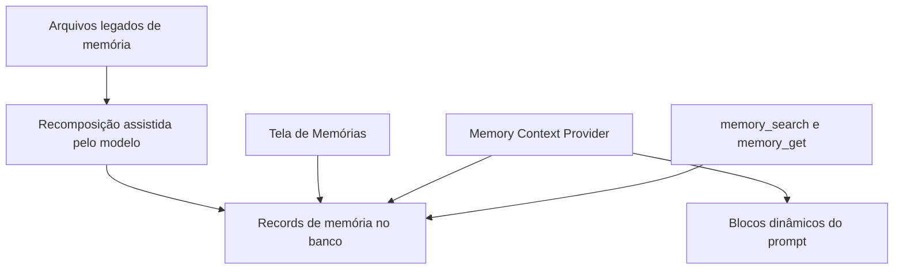

# Tela De Memórias Na AEP-0075

## Decisão

A AEP-0075 deve incluir uma UI de gerenciamento de memórias no frontend. Ao migrar a memória para records estruturados em banco, o usuário perde a edição direta via `~/.assistente/memory/*.md`; portanto, a aplicação precisa oferecer uma tela própria para visualizar, editar e governar essas memórias.

## Escopo Inicial

Adicionar uma página de memórias com:

- Lista pesquisável/filtrável de records salvos.
- Visualização de conteúdo, classificação e metadados essenciais.
- Edição de conteúdo, `load_policy`, `kind`, `scope`, tags e importância.
- Ações para arquivar/desarquivar e excluir com confirmação.
- Indicação clara de quais memórias entram automaticamente no contexto: `core`, `pinned` e candidatas `auto`.
- Suporte à recomposição assistida: o modelo pode criar records a partir dos arquivos legados, e o usuário revisa na tela.

## UX E Acessibilidade

Usar componentes existentes em `frontend/src/components/ui/`, especialmente `DataGrid`, `Modal`, `ConfirmDialog`, `Button` e `Toolbar`. Todas as strings devem ir para `frontend/src/locales/pt-BR.ts`, `frontend/src/locales/en.ts` e `frontend/src/locales/es.ts`.

A tela deve evitar cores hardcoded e usar somente tokens de `frontend/src/theme.css`.

## Backend Necessário

Expor APIs Wails para CRUD e busca de memória:

- listar com filtros;
- obter detalhe;
- criar/editar record;
- arquivar/desarquivar;
- excluir;
- buscar records relevantes para `memory_search`.

## Arquitetura

## Critérios De Aceitação

- O usuário consegue ver e editar memórias salvas sem abrir arquivos Markdown.
- O usuário consegue alterar a política de carregamento de uma memória.
- Memórias `archived` não entram no contexto automático.
- Exclusão exige confirmação acessível.
- A tela deixa claro quais memórias impactam o prompt automaticamente.
- A recomposição dos arquivos antigos continua sem migrador automático; a revisão acontece pela UI.