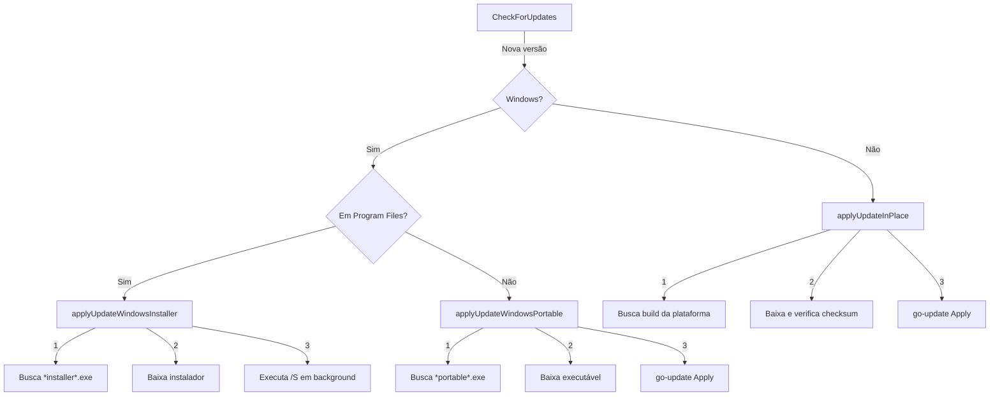

# Auto-Update: Portátil vs Instalado

## Visão Geral

O sistema de auto-update agora detecta automaticamente se o aplicativo está rodando em versão **instalada** ou **portátil** no Windows, aplicando a estratégia de atualização mais adequada para cada caso.

## Estratégias por Plataforma

### Windows

#### 🏢 Versão Instalada (Program Files)
- **Detecção**: Executável localizado em `C:\Program Files` ou `C:\Program Files (x86)`
- **Método**: Baixa e executa instalador NSIS em modo silencioso (`/S`)
- **Asset**: `*installer*.exe`, `*setup*.exe` ou `*windows-installer*.exe`
- **Processo**:
  1. Detecta que está em Program Files
  2. Busca instalador no GitHub Release
  3. Baixa o instalador NSIS
  4. **Solicita elevação UAC automaticamente**
  5. Executa `instalador.exe /S` em modo silencioso
  6. **Fecha o aplicativo automaticamente (os.Exit)**
  7. Instalador detecta que o app fechou e substitui o executável
  8. **Instalador reabre o aplicativo automaticamente após atualização**
  9. Instalador se auto-remove

**Recursos do Instalador:**
- ✅ Opção para executar o programa após instalação manual
- ✅ Reabertura automática após atualização silenciosa
- ✅ Solicitação automática de permissões de administrador (UAC)

#### 📦 Versão Portátil (Qualquer outro local)
- **Detecção**: Executável fora de Program Files (Desktop, USB, pastas personalizadas)
- **Método**: Baixa executável portátil e substitui in-place
- **Asset**: `*portable*.exe` ou `*windows*.exe` (exceto installer/setup)
- **Processo**:
  1. Detecta que NÃO está em Program Files
  2. Busca versão portátil no GitHub Release
  3. Baixa o executável portátil
  4. Usa `go-update` para substituir o executável atual
  5. Aplica com rollback automático em caso de erro

### Linux

- **Método**: Atualização in-place sempre
- **Asset**: Build específico da plataforma (ex: `*linux-amd64`)
- **Processo**:
  1. Baixa o executável
  2. Verifica checksum (se disponível)
  3. Substitui usando `go-update`
  4. Rollback automático em caso de erro

### macOS

- **Método**: Atualização in-place (similar ao Linux)
- **Asset**: Build específico da plataforma (ex: `*darwin-amd64`)
- **Processo**: Igual ao Linux
- **Nota**: Futuramente pode usar `.app` bundle ou `.dmg` se necessário

## Detecção Automática

### Função `isInstalledVersion()`

```go
func (u *Updater) isInstalledVersion() bool {
    // Obtém caminho do executável
    exePath, _ := os.Executable()
    
    // Normaliza para lowercase
    exePath = strings.ToLower(filepath.Clean(exePath))
    
    // Verifica se contém "program files"
    return strings.Contains(exePath, "program files") ||
           strings.Contains(exePath, "program files (x86)")
}
```

### Log de Detecção

```
[Updater] Caminho do executável: c:\users\leonar\desktop\assistente.exe
[Updater] ✓ Executável fora de Program Files - versão portátil
[Updater] 📦 Versão portátil detectada - substituindo executável...
```

```
[Updater] Caminho do executável: c:\program files\assistente\assistente.exe
[Updater] ✓ Executável em Program Files - versão instalada
[Updater] 📦 Versão instalada detectada - usando instalador NSIS...
```

## Nomenclatura de Assets no GitHub Release

Para o sistema funcionar corretamente, os assets devem seguir os padrões:

### Windows Instalado
- `assistente-installer-windows-amd64.exe` ✅
- `assistente-setup-v1.0.0.exe` ✅
- `assistente-windows-installer.exe` ✅

### Windows Portátil
- `assistente-portable-windows-amd64.exe` ✅
- `assistente-windows-amd64.exe` ✅ (se não contiver "installer" ou "setup")
- `assistente-v1.0.0-portable.exe` ✅

### Linux
- `assistente-linux-amd64` ✅
- `assistente-linux-arm64` ✅

### macOS
- `assistente-darwin-amd64` ✅
- `assistente-darwin-arm64` ✅

## Vantagens da Abordagem

### ✅ Versão Instalada (Instalador NSIS)
- Não requer UAC / elevação de privilégios
- Instalador é auto-contido e robusto
- Atualiza atalhos, registro, etc.
- Melhor experiência para usuários finais
- Executável não fica bloqueado durante atualização

### ✅ Versão Portátil (Substituição Direta)
- Não deixa rastros no sistema
- Funciona em qualquer local (USB, rede, etc.)
- Não requer permissões administrativas
- Rápido e direto
- Ideal para ambientes corporativos restritos

## Fluxo de Atualização



## Tratamento de Erros

### Instalador Não Encontrado
```
Erro: instalador do Windows não encontrado no release (encontrados 5 assets)
```
**Solução**: Garantir que o release tem um asset `*installer*.exe`

### Portátil Não Encontrado
```
Erro: versão portátil do Windows não encontrada no release
```
**Solução**: Garantir que o release tem um asset `*portable*.exe` ou `*windows*.exe`

### Falha ao Aplicar Atualização
```
Erro: falha ao aplicar update (rollback realizado)
```
**Solução**: O rollback foi aplicado, aplicativo continua na versão anterior

## Testing

### Testar Versão Instalada
1. Instalar aplicativo em `C:\Program Files\Assistente`
2. Executar a aplicação
3. Verificar logs: deve detectar "versão instalada"
4. Testar atualização: deve baixar instalador

### Testar Versão Portátil
1. Copiar executável para `C:\Users\Usuario\Desktop`
2. Executar a aplicação
3. Verificar logs: deve detectar "versão portátil"
4. Testar atualização: deve baixar executável portátil

### Logs Relevantes
```
[Updater] Caminho do executável: <path>
[Updater] ✓ Executável em/fora de Program Files
[Updater] 📦 Versão instalada/portátil detectada
[Updater] Buscando instalador/versão portátil entre X assets...
[Updater] Asset encontrado: <nome>
[Updater] ✓ Instalador/Versão portátil selecionado(a)
[Updater] ✅ Atualização aplicada com sucesso
```

## Próximos Passos

1. ✅ Implementar detecção de versão instalada vs portátil
2. ✅ Criar funções separadas para cada estratégia
3. ✅ Adicionar logging detalhado
4. 🔄 Testar com releases reais
5. 🔄 Ajustar nomenclatura de assets se necessário
6. 🔄 Considerar .app bundle para macOS no futuro
