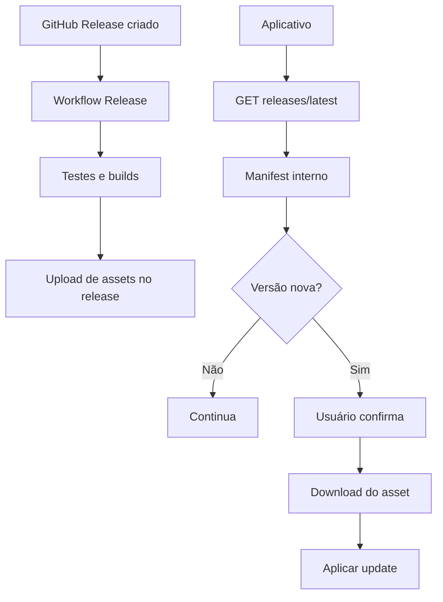

# Sistema de Auto-Update

Status: Done — atualizado para a implementação real em `internal/updater/updater.go` e `.github/workflows/release.yml`

## Resumo

O auto-update do Assistente usa a API de GitHub Releases como fonte canônica de versões e assets. O aplicativo consulta `https://api.github.com/repos/inclunet/assistente/releases/latest`, converte a resposta da API para o modelo interno `Manifest` e baixa o asset compatível com a plataforma atual.

GitHub Pages e `update-manifest.json` não fazem parte do fluxo de auto-update atual.

## Motivação

A arquitetura original previa publicar um manifest estático em GitHub Pages. A implementação evoluiu para GitHub Releases para reduzir duplicação de metadados, usar os assets já publicados no release e permitir que o workflow de release seja a única fonte de verdade para binários, checksums e notas.

## Decisões

- A fonte de atualização é a API de GitHub Releases, via `GitHubAPIURL`.
- O workflow `.github/workflows/release.yml` é acionado por `release.created`, executa testes/builds, consolida assets e anexa os arquivos ao release existente.
- `fetchManifest()` adapta `tag_name`, `published_at`, `body` e `assets` da API para o `Manifest` interno usado por `CheckForUpdates()` e `ApplyUpdate()`.
- A comparação de versão normaliza o prefixo `v` apenas para comparação, permitindo tag `v1.0.1` e `AppVersion` `1.0.1` sem falso positivo de update.
- O app detecta a plataforma com `getBuildKey()` e seleciona apenas executáveis desktop publicados pelo workflow atual com prefixo `assistente-`, como `assistente-windows-amd64.exe` e `assistente-linux-amd64`. Assets CLI `asst-*`, checksums, instaladores, pacotes (`.deb`, `.rpm`, `.msi`, `.pkg`), arquivos compactados, `.dmg` e `.AppImage` não entram no manifest interno de atualização in-place.
- No Windows instalado em `Program Files`, a atualização usa o instalador NSIS publicado no release e solicita elevação via UAC.
- No Windows portátil e Linux, a atualização in-place ainda usa `github.com/inconshreveable/go-update`.
- Checksums são publicados como assets (`checksums.txt`), mas a verificação automática só ocorre quando o campo `Checksum` do `Manifest` interno estiver preenchido. A integração automática com `checksums.txt` permanece como melhoria futura.
- A dependência `go-update` é mantida por enquanto para os fluxos portátil/in-place. Como ela não é mantida há anos, a troca por uma alternativa mantida, como `minio/selfupdate`, deve ser avaliada antes de ampliar o escopo do updater.

## Fases

1. Criar ou publicar um GitHub Release com tag semântica (`vX.Y.Z` é aceito; o updater normaliza `v` na comparação).
2. O workflow `Release` roda testes, builds desktop/CLI e geração de checksums.
3. O job final faz upload dos assets consolidados para o GitHub Release existente.
4. O aplicativo consulta periodicamente o release mais recente pela API do GitHub.
5. Quando a versão do release difere da versão atual, o usuário pode iniciar o download e aplicação do update.

## Fluxo

## Critérios de Aceite

- A documentação não deve orientar criação de `update-manifest.json` para auto-update.
- O quickstart de release deve orientar criação/publicação de GitHub Release, não deploy em GitHub Pages.
- Fixtures mortas de manifest estático devem ser removidas para evitar falsa fonte de verdade.
- Mudanças futuras no updater devem manter `internal/updater/updater.go`, `.github/workflows/release.yml` e esta AEP alinhados.

## Riscos

- A seleção de assets depende de convenções de nome; mudanças no workflow precisam preservar os padrões usados por `fetchManifest()`, `applyUpdateWindowsInstaller()` e `applyUpdateWindowsPortable()`, especialmente o prefixo desktop `assistente-`.
- Releases privadas exigem token configurado via `SetGitHubToken()`.
- A ausência de checksum automático no `Manifest` interno reduz a validação de integridade nos fluxos in-place até que `checksums.txt` seja consumido pelo updater.
- `go-update` é uma dependência antiga e deve ser substituída se o updater passar por uma revisão funcional maior.

## Referências

- `internal/updater/updater.go`
- `.github/workflows/release.yml`
- [GitHub Releases](https://docs.github.com/en/repositories/releasing-projects-on-github)
- [go-update](https://github.com/inconshreveable/go-update)
- [minio/selfupdate](https://github.com/minio/selfupdate)
