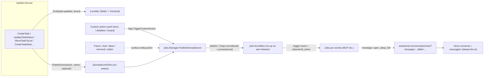

# AEP-0067 — Eventos de domínio de Tasklists e Custom Actions

Status: Proposto
Data: 2026-06-02
Autor: Inclunet + Cursor Agent

## Resumo

Esta AEP estabelece um **barramento de eventos de UI/domínio** que alimenta o
`EventBus` de jobs (AEP-0001/0048/0063), tendo as **tasklists como primeiro
produtor concreto**. Três entregas se conectam:

1. **Eventos de domínio de tasklists** — as mutações do `tasklist.Service`
   (criar/editar/mover/mudar status de card, notas, listas, workflow) passam a
   publicar eventos semânticos no `EventBus`, com namespacing dotted
   (`tasklist.<entidade>.<ação>`), payload normalizado e **proveniência
   anti-loop**.
2. **Refresh manual** — um gatilho one-shot, iniciado pelo usuário, para
   destravar listas paradas (jobs automáticos que não rodaram).
3. **Custom actions por lista** — cada `TaskList` declara **ações customizáveis**
   (ex.: "Investigar", "Atualizar") que aparecem no menu de contexto do card,
   na tela de detalhes e/ou no menu do board, e que **publicam um evento** e/ou
   **abrem um link** (deeplink interno ou URL externa), reaproveitando a stack de
   configuração de eventos do JobBuilder e a infra de deep links (AEP-0023).

A abstração é desenhada como **app-wide**: no futuro, outras superfícies (chat,
troca de abas, terminal, editor) podem produzir eventos sem mudança estrutural.

## Motivação

O sistema de jobs (AEP-0001) reage muito bem a eventos, mas hoje o `EventBus` só
recebe `job.*.success/failure` (publicados em `internal/jobs/executor.go`). O
`tasklist.Service` **já emite** sinais de lifecycle (`task:created/updated`,
`taskNote:created/...`, `taskList:*`, `workflow:updated`) — mas só para o
frontend (Wails), via `a.emitter`. Não há ponte desses sinais para o `EventBus`,
nem forma de a UI publicar um evento arbitrário, nem de o usuário disparar uma
ação contextual de um card.

Casos de uso concretos:

- Lista "presa" porque o job periódico não rodou → usuário clica **Atualizar** e
  um job por evento ressincroniza.
- Card sincronizado de sistema externo → usuário clica **Investigar** → abre uma
  conversa nova já com o contexto do card (via deep link) ou aciona um job.
- Cliente respondeu (nova nota) → job notifica/triagem automaticamente.

Pré-requisito **já atendido**: a AEP/PR #164/#166 corrigiu o `context canceled`
em runs por evento (publisher cancelava o ctx do subscriber). Sem isso, runs por
evento de domínio não funcionariam.

## Relação com outras AEPs

- **AEP-0001** (Jobs — Event-Driven Automation), **AEP-0048** (Jobs DB) e
  **AEP-0063** (Tool Invocations e Executor Comum): o `EventBus`, triggers e
  execução de tools reaproveitados aqui.
- **AEP-0036** (Task List Manager Feature): a AEP base das tasklists. Está sendo
  **alinhada à realidade no mesmo PR** desta AEP (o modelo de dados da 0036
  diverge da implementação; ver a nota de status na própria 0036).
- **AEP-0023** (Deep Links): `open_deep_link` (tool) e `openTaskLink` (frontend)
  reaproveitados nas custom actions.
- **AEP-0034** (Unified Workspace): superfícies futuras (chat/abas/terminal/editor)
  como produtores de evento.
- **AEP-0058** (Arbitragem Global de Acessibilidade): custom actions no menu e na
  tela de detalhes respeitam o announcer único e o gerenciamento de foco.

## Decisões

### 1) Barramento de eventos de UI/domínio (genérico)

- Nova API pública no `jobs.Manager`: `PublishDomainEvent(ctx, name string, payload map[string]any)`,
  que faz `scopedContext(ctx)` e `eventBus.Publish(context.WithoutCancel(ctx), name, payload)`
  (`WithoutCancel` alinhado ao fix #166).
- **Custo zero sem listener**: `EventBus.Publish` já é no-op quando não há
  subscribers (`internal/jobs/eventbus.go` loga "no listeners"). Logo, espalhar
  emissões pelas superfícies é barato e seguro — só faz algo **se um job estiver
  vinculado**.
- **Namespacing `<superfície>.<entidade>.<ação>`**: `tasklist.task.updated`,
  `tasklist.card.investigate`, e (futuro) `chat.message.sent`,
  `workspace.tab.changed`, `terminal.command.run`, `editor.file.saved`.
- A abstração (`PublishDomainEvent` + um `DomainEventSink` ctx-aware) serve a
  qualquer produtor; o `tasklist.Service` é a implementação de referência.

### 2) Proveniência e anti-loop (decisão crítica)

Um job cujo tool muta a tasklist dispara `tasklist.*` → pode re-disparar jobs →
loop. O `ports.Emitter.Emit(event, data)` **não recebe `context.Context`**, mas o
circuit breaker depende de `_chain_id`/`_chain_history` no payload. Por isso:

- Introduzir um `DomainEventSink` **ctx-aware**, injetado no `tasklist.Service`,
  chamado nos mesmos pontos de mutação. O `Service` já tem `ctx` em todos os
  métodos.
- **Caminho verificado**: o `ctx` do run flui do executor (`tool.Execute(ctx)`)
  para a tool `task_list` (`t.mgr.<método>(ctx, ...)`) até o `Service`. Logo, dá
  para distinguir mutação-por-job de mutação-por-humano **no ponto de emissão**.
- O executor carimba no `ctx` do run (via `context.WithValue`): `_source="job"`,
  `_source_job_id`, `_chain_id`, `_chain_history`. Mutações sem essa marca são
  `_source="user"`.
- Defesas combinadas:
  1. **Proveniência** alimenta o circuit breaker existente (`DetectLoop`/`MaxChainDepth`).
  2. `trigger.when` pode ignorar auto-induzidos: `{{ ne .event._source_job_id "este-job" }}`.
  3. **Default recomendado**: jobs reagem só a mudanças humanas —
     `{{ eq .event._source "user" }}` — salvo quando o encadeamento job→job for
     intencional.
  4. **Rate limit** (`max_runs_per_hour`, já existe) como rede de segurança.
  5. **Filtros** por `task_list_slug`/`status_id`/`note_type`.

### 3) Ponto único de emissão (múltiplos entrypoints convergem)

Cada evento de domínio é emitido **uma única vez, no método de mutação do
`Service`** — nunca por gesto de UI nem por tool. A mesma mutação tem vários
entrypoints; ex.: mudar status de um card pode vir de:

- Context menu "Mover para…", pegar/soltar com barra de espaço, Alt+setas,
  drag-and-drop com mouse, tela de detalhes — todos convergem em
  `service.UpdateTaskStatus`.
- **Job/tool** (automação) via a tool `task_list` — mesmo método de Service.

Emitir `tasklist.task.status_changed` só em `service.UpdateTaskStatus` cobre
todos os entrypoints sem duplicação. O `Emit` Wails atual (frontend) permanece
intacto.

### 4) Custom actions por lista (`custom_actions`)

Não é uma "policy" nem um "context menu" — é um conjunto de **custom actions** da
lista. Uma action pode ser disparada pelo menu de contexto do card, pela tela de
detalhes (`TaskDetailModal`) e/ou pelo menu do board.

- **Aditivo, nunca destrutivo**: os itens nativos do menu (Detalhes, Editar,
  Mover para…, Deletar) e as ações nativas da tela de detalhes **continuam
  sempre existindo**. Custom actions são **adicionadas**, nunca removem nem
  substituem os nativos.
- Segue os precedentes de config por lista: `validation_policy` (coluna JSON em
  `task_lists`) e `workflow` (editor modal em `TaskListView`).
- Persistência: coluna JSON `custom_actions TEXT` em `task_lists`.
- Backend: `Get/SetTaskListCustomActions` + `TriggerCustomAction(taskListID,
  taskID, actionID) (string, error)` — renderiza `payload_template`/`link`
  server-side via `internal/jobs/template.go`, publica `event` via
  `PublishDomainEvent` (com proveniência), e devolve o `link` renderizado para o
  frontend executar via `openTaskLink`.
- Frontend: `CustomActionsEditor` (modal em `TaskListView`, padrão do
  `WorkflowEditor`) reusando `Combobox` + `ListKnownEvents` (nome do evento) e
  `TemplateEditor` (payload/link/when, com autocomplete sobre `.task`).

Ver o schema completo em "Schema de custom_actions" abaixo.

### 5) Refresh manual

- **Não é um item nativo/fixo.** O refresh é uma **custom action opcional** que o
  usuário cria por lista (surface `board`, `event: tasklist.list.refresh_requested`).
  Não há botão "Atualizar" sempre presente — ele só existe se for definido nas
  `custom_actions` da lista.
- Disparo pelo caminho genérico `App.TriggerCustomAction(taskListID, "", actionID)`
  → `PublishDomainEvent` (com proveniência). One-shot, iniciado pelo usuário, sem
  ciclo. Um job vinculado por `listen: tasklist.list.refresh_requested` ressincroniza
  a lista.

### 6) Catálogo de eventos na UI

`ListKnownEvents()` deriva nomes só dos jobs existentes. Adicionar:

- Catálogo **estático** dos eventos de domínio (este documento) para aparecerem
  no picker do `JobBuilder` mesmo sem job referenciando.
- **União** com os `event` configurados nas `custom_actions` de todas as listas.
- Schema estático para `InferEventSchema` desses nomes.
- Extensível para superfícies futuras (`chat.*`, `workspace.tab.*`, etc.).

## Fluxo



## Mapa de eventos de domínio (cards e tasklists)

Catálogo canônico publicado pelo `tasklist.Service`. Hoje o `Emit` Wails é
**grosseiro** (status/assignee/move/promote/demote colapsam em `task:updated`); o
mapa de domínio é **mais granular**, porque para jobs cada operação é um gatilho
distinto. Cada payload carrega campos-base por entidade + proveniência
(`_source`, `_source_job_id`, `_chain_id`, `_chain_history`).

Campos-base por entidade:

- **task**: `task_id`, `task_list_id`, `task_list_slug`, `code`, `title`,
  `status_id`, `parent_id`, `assignee_id`, `assignee_name`, `creator_id`,
  `due_date`, `completed_at`, `link`
- **note**: `note_id`, `task_id`, `task_list_id`, `task_list_slug`, `note_type`
  (1 interna / 2 cliente / 3 agente / 4 sistema), `source` (externo),
  `external_id`, `author_id`
- **list**: `task_list_id`, `task_list_slug`, `title`
- **workflow**: `task_list_id`, `task_list_slug`, `initial_status_id`

| Evento | Origem (`tasklist.Service`) | Quando dispara | Tipo |
|---|---|---|---|
| `tasklist.task.created` | `CreateTask`/`CreateTaskFull` | Card criado | Já emite (`task:created`) |
| `tasklist.task.updated` | `UpdateTask`/`UpdateTaskFull` | Edição de campos (+`changed_fields`) | Já emite (`task:updated`) |
| `tasklist.task.status_changed` | `UpdateTaskStatus` | Mudança de status (+`from_status_id`) | Novo (hoje `task:updated`) |
| `tasklist.task.assignee_changed` | `UpdateTaskAssignee` | Troca de responsável (+`from_assignee_id`) | Novo |
| `tasklist.task.moved` | `MoveTaskToList` | Card movido entre listas (+`from_task_list_id`) | Novo |
| `tasklist.task.reparented` | `PromoteTask`/`DemoteTask` | Vira subtask / sobe a topo (+`from_parent_id`) | Novo |
| `tasklist.task.reordered` | `ReorderTasks` | Reordenação na coluna | Novo (opcional, ruidoso) |
| `tasklist.task.completed` | derivado de `UpdateTaskStatus` | Status leva a `completed_at != nil` | Novo (opcional) |
| `tasklist.task.deleted` | `DeleteTask` | Card removido | Já emite (`task:deleted`) |
| `tasklist.note.added` | `CreateTaskNote`/`UpsertTaskNoteByExternal` | Nota criada | Já emite (`taskNote:created`) |
| `tasklist.note.updated` | `UpdateTaskNote`/`UpsertTaskNoteByExternal` | Nota editada | Já emite (`taskNote:updated`) |
| `tasklist.note.deleted` | `DeleteTaskNote` | Nota removida | Já emite (`taskNote:deleted`) |
| `tasklist.list.created` | `CreateTaskList` | Lista criada | Já emite (`taskList:created`) |
| `tasklist.list.cloned` | `CloneTaskList` | Lista clonada (+`source_task_list_id`) | Novo (hoje `taskList:created`) |
| `tasklist.list.updated` | `UpdateTaskList`/`UpdateTaskListFull`/`SetTaskListViewMode` | Título/descrição/view mode | Já emite (`taskList:updated`) |
| `tasklist.list.cleared` | `ClearTaskList` | Lista esvaziada | Já emite (`taskList:cleared`) |
| `tasklist.list.deleted` | `DeleteTaskList` | Lista removida | Já emite (`taskList:deleted`) |
| `tasklist.list.refresh_requested` | `TriggerCustomAction` (custom action de board, opcional) | Custom action "Atualizar" (não-nativa) | Novo |
| `tasklist.workflow.updated` | `UpdateWorkflow`/`UpdateWorkflowFull`/`ReorderWorkflowStatuses` | Workflow alterado | Já emite (`workflow:updated`) |
| `tasklist.item.opened` | `App.NotifyTaskOpened` (opcional) | Card aberto para detalhe | Novo (opcional, read-side) |
| `tasklist.card.investigate` | `TriggerCustomAction` (custom action) | Action "Investigar" | Novo (custom, nome livre) |
| `tasklist.card.refresh` | `TriggerCustomAction` (custom action) | Action "Atualizar" do card | Novo (custom, nome livre) |

### Risco de loop por evento

- **Alto**: `task.updated`, `task.status_changed`, `task.assignee_changed`,
  `task.moved`, `task.reparented`, `note.added`/`updated` (jobs costumam mudar
  status e adicionar notas).
- **Médio**: `task.created`/`deleted`, `list.*`, `workflow.updated`.
- **Baixo/seguro**: `list.refresh_requested`, `item.opened`, custom actions
  iniciadas por humano (one-shot). O job-alvo ainda precisa de proveniência se
  ele mesmo mutar.

## Schema de `custom_actions`

Coluna JSON `custom_actions TEXT` em `task_lists` (espelha `validation_policy`).

```go
// internal/database/tasklist_custom_actions.go (novo)
type TaskListCustomActions struct {
    Actions []CustomAction `json:"actions,omitempty"`
}

type CustomAction struct {
    ID              string   `json:"id"`                          // estável (slug)
    Label           string   `json:"label"`                       // texto do item/botão
    Icon            string   `json:"icon,omitempty"`              // emoji/ícone opcional
    Surfaces        []string `json:"surfaces,omitempty"`          // "card_menu" (default) | "card_detail" | "board_menu"
    Event           string   `json:"event,omitempty"`             // evento a publicar (opcional)
    PayloadTemplate string   `json:"payload_template,omitempty"`  // Go template -> JSON object
    Link            string   `json:"link,omitempty"`              // Go template -> deeplink interno OU URL externa (opcional)
    When            string   `json:"when,omitempty"`              // Go template de visibilidade (truthy)
    Danger          bool     `json:"danger,omitempty"`
    Confirm         string   `json:"confirm,omitempty"`           // texto de confirmação opcional
}
```

Regras:

- `event` e `link` são **ambos opcionais e combináveis**; pelo menos um deve
  estar presente (validação).
- `payload_template`, `link` e `when` são avaliados com a stack de
  `internal/jobs/template.go`, com a raiz **`.task`** (campos normalizados do
  card) + `.now` + funções (`json`, `default`, `pluck`, `date`, `now`, ...).
- `when` é avaliado no frontend sobre os campos do card (truthy = mostra o item).
  O `code` ≡ external id do card; ex.: só mostrar para cards externos com
  `{{ ne .task.code "" }}`.
- `link` pode usar o link externo do card: `{{ .task.link }}` (campo `Task.Link`).

Exemplo gravado na coluna:

```json
{
  "actions": [
    {
      "id": "investigate",
      "label": "Investigar",
      "icon": "🔎",
      "surfaces": ["card_menu", "card_detail"],
      "when": "{{ ne .task.code \"\" }}",
      "event": "tasklist.card.investigate",
      "payload_template": "{\n  \"code\": {{ json .task.code }},\n  \"title\": {{ json .task.title }},\n  \"prompt\": {{ json (printf \"Investigue o card %s: %s\" .task.code .task.title) }}\n}"
    },
    {
      "id": "open-external",
      "label": "Abrir no sistema externo",
      "icon": "🔗",
      "surfaces": ["card_menu", "card_detail"],
      "when": "{{ ne .task.link \"\" }}",
      "link": "{{ .task.link }}"
    }
  ]
}
```

Evento publicado ao acionar "Investigar" num card `code=PROJ-123` — payload =
template renderizado + campos-base + proveniência:

```json
{
  "code": "PROJ-123",
  "title": "Corrigir login",
  "prompt": "Investigue o card PROJ-123: Corrigir login",

  "task_id": "0b3f...",
  "task_list_id": "9ad1...",
  "task_list_slug": "suporte",
  "action_id": "investigate",
  "_source": "user",
  "_chain_id": "f12c...",
  "_chain_history": ["tasklist.card.investigate"]
}
```

Job vinculado abre a conversa (ou a própria action faz, via `link`):

```yaml
trigger:
  type: event
  listen: tasklist.card.investigate
steps:
  - tool: open_deep_link
    inputs:
      uri: 'assistente://conversation/new?message={{ .event.prompt }}&title=Investigar {{ .event.code }}'
```

## Fases (PRs incrementais, em sequência após esta AEP aprovada)

- **PR 0 (este)**: documentação — AEP-0067 + alinhamento da AEP-0036.
- **Fase 1 — Base do barramento de eventos de domínio**: `PublishDomainEvent`,
  catálogo estático de eventos (inclui `tasklist.list.refresh_requested`) e
  fallback de `InferEventSchema`. Maior valor, sem risco de loop. (O refresh
  deixou de ser um botão fixo; passa a ser uma custom action opcional — ver §5
  e Fase 5.)
- **Fase 2 — Ponte de eventos de lifecycle**: `DomainEventSink`, emissão dos
  eventos de domínio nos pontos de mutação do `Service` (payload normalizado).
- **Fase 3 (opcional) — `tasklist.item.opened`** (read-side).
- **Fase 4 — Proveniência/anti-loop**: carimbo no ctx do run + leitura no
  `Service`; default `when` por `_source`.
- **Fase 5 — Custom actions**: storage `custom_actions`, bindings, editor UI,
  render aditivo (menu/detalhes/board).
- **Transversal — Docs**: atualizar a skill `job-manager` (novos eventos, recipes
  de refresh/investigar, avisos de loop/filtros).

## Anti-loop (resumo)

O caminho job → tool `task_list` → `Service` é verificado, e o mesmo `ctx` do run
chega ao emissor. Sem o carimbo de origem, o emissor não distingue job de
usuário; por isso a proveniência (Fase 4) é pré-requisito dos eventos mutáveis de
alto risco. Mitigações combinadas: proveniência + circuit breaker + `trigger.when`
(default `_source == "user"`) + rate limit + filtros.

## Riscos

- **Loop por job que muta tasklist**: principal risco; mitigado por proveniência +
  circuit breaker + default `when`. Sem proveniência, não habilitar eventos de
  alto risco.
- **Ruído de eventos**: `reordered`/`item.opened` são opcionais e podem ser
  desligados; jobs filtram via `when`/`emit_when`.
- **Template inválido em `payload_template`/`link`**: renderização server-side
  valida e faz log; action não publica evento malformado.
- **Acessibilidade das custom actions**: devem respeitar foco e announcer único
  (AEP-0058); nunca remover itens nativos.

## Critérios de aceitação

- [ ] `Manager.PublishDomainEvent` publica no `EventBus` (subscriber recebe).
- [ ] Refresh manual publica `tasklist.list.refresh_requested` a partir do menu do board.
- [ ] Eventos de domínio emitidos num único ponto do `Service` (todos os entrypoints convergem).
- [ ] Proveniência (`_source`/`_source_job_id`/`_chain_id`) no payload; job que muta card não re-dispara a si mesmo com `when {{ eq .event._source "user" }}`.
- [ ] `custom_actions` persistido (coluna JSON), editável via UI; itens nativos preservados.
- [ ] `TriggerCustomAction` renderiza `payload_template`/`link` e publica o evento; `link` abre deeplink interno ou URL externa.
- [ ] Eventos de domínio + eventos das custom actions aparecem no picker do `JobBuilder`.
- [ ] Skill `job-manager` documenta os novos eventos e recipes.
- [ ] Testes Go (publish/sink/refresh/custom action/anti-loop) e frontend (menu/detalhes/binding) + build.

## Fora de escopo

- Alterar a semântica dos eventos Wails atuais para o frontend (continuam iguais).
- Reintroduzir `external_*` no `Task` (a AEP-0036 está sendo corrigida; `code` ≡ external id).
- Multi-usuário simultâneo (app é desktop single-user; `Manager` já é por-usuário).
- Produtores de evento em outras superfícies (chat/abas/terminal/editor) — documentados como visão futura.
