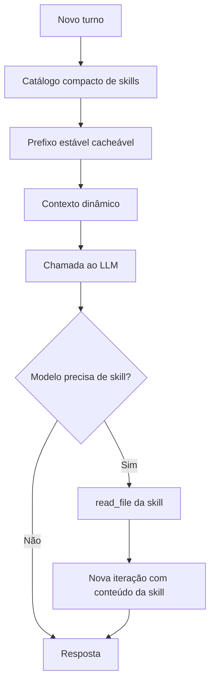

# AEP-0074 — Prompt Cache, Custo de LLM e Contexto Dinâmico

Status: Proposta
Criado em: 2026-06-16
Depende de: AEP-0075 (Context Providers), AEP-0072 revisada (Skill Loading Runtime)
Relacionado: AEP-0012, AEP-0059, AEP-0051, AEP-0039

## Resumo

O Assistente deve passar a tratar prompt/context caching como uma capacidade arquitetural explícita, não como um detalhe invisível de providers. Muitos providers modernos reduzem custo e latência quando requisições consecutivas compartilham um prefixo idêntico, mas a montagem atual do prompt mistura conteúdo estável com conteúdo dinâmico no início da request, o que reduz cache hits.

Esta AEP define:

- uma matriz de providers com suporte a cache;
- uma política de layout do prompt em blocos estáveis e dinâmicos;
- uma estratégia específica para memórias e skills, que hoje podem mudar a cada turno;
- normalização de métricas de cache para custo real;
- fases incrementais para implementar observabilidade antes de otimizações comportamentais.

Ordem arquitetural obrigatória:

1. AEP-0075 separa memória, workspace e outros estados dinâmicos em Context Providers.
2. AEP-0072 revisada redefine skills como módulos de instrução/workflow com carregamento explícito.
3. Esta AEP otimiza prompt cache sobre essa separação.

## Motivação

DeepSeek, OpenAI, Anthropic, Gemini, xAI, Qwen, Mistral e Kimi já oferecem alguma forma de prompt/context caching. O mecanismo varia, mas a regra prática converge: conteúdo repetido e idêntico no início da request tende a ser cacheável; conteúdo dinâmico no início invalida o cache do restante.

Hoje o Assistente reconstrói o prompt completo a cada envio. Isso é correto funcionalmente, mas tem riscos de custo:

- skills `auto_load` entram cedo no system prompt;
- templates de skill podem incluir `{{ now }}`;
- a skill `memory` injeta memória do usuário e data/hora no prompt;
- resumo, arquivos abertos, superfície ativa e tasklists vinculadas entram como contexto dinâmico;
- tool definitions e lista de skills podem mudar de ordem se não houver ordenação determinística;
- o uso de tokens salvo no banco não distingue tokens cacheados de tokens processados a custo cheio.

Mesmo que DeepSeek seja barato, o mesmo padrão afeta OpenAI, Claude, Gemini, Grok, Qwen, Mistral, Kimi e rotas via LiteLLM/OpenRouter. O objetivo é reduzir custo sem degradar qualidade, tool calling, MCP nativo, memória ou skills.

## Providers com cache relevante

### Cache automático por prefixo

- DeepSeek: automático; usage com `prompt_cache_hit_tokens` e `prompt_cache_miss_tokens`.
- OpenAI: automático para prompts longos; usage com `prompt_tokens_details.cached_tokens`; algumas APIs aceitam `prompt_cache_key`.
- xAI/Grok: automático; recomenda `x-grok-conv-id` ou `prompt_cache_key`; usage com `cached_tokens`.
- Gemini 2.5+ / Vertex: cache implícito automático em modelos recentes; usage com `cachedContentTokenCount`.
- Qwen/DashScope: cache implícito por padrão; usage com `cached_tokens`.
- Moonshot/Kimi: prefix cache com `prompt_cache_key`; usage com `cached_tokens`.

### Cache explícito ou híbrido

- Anthropic: `cache_control` em blocos; usage com `cache_creation_input_tokens`, `cache_read_input_tokens` e `input_tokens`.
- Gemini/Vertex: `cachedContents` explícito com TTL, além do implícito.
- Qwen/DashScope: `cache_control`, session cache e cache implícito.
- Mistral: `prompt_cache_key`; usage com `prompt_tokens_details.cached_tokens`.

### Gateways

- LiteLLM: suporta/normaliza prompt caching para OpenAI, Anthropic, Gemini/Vertex, Bedrock, DeepSeek, xAI, DashScope/Qwen, OpenRouter e outros. Pode expor campos OpenAI-style ou campos específicos.
- OpenRouter: pode expor `cached_tokens`, `cache_write_tokens` e `cache_discount`, dependendo da rota.

## Decisões

### D1. O prompt passa a ter blocos com classe de volatilidade

Todo conteúdo injetado no prompt deve ser classificado em uma destas classes:

- `stable`: muda apenas em deploy, edição explícita de skill/regra ou alteração de provider/profile.
- `session`: muda pouco, por sessão/conversa, mas não a cada turno.
- `conversation`: muda conforme a conversa evolui, por exemplo resumo.
- `turn`: muda em cada envio, por exemplo input do usuário, slash skill, superfície ativa.
- `volatile`: muda por relógio, aleatoriedade, estado externo não versionado ou leitura dinâmica.

Regra de layout:

1. Blocos `stable` vêm primeiro.
2. Blocos `session` vêm depois.
3. Blocos `conversation`, `turn` e `volatile` ficam no sufixo.

O prefixo cacheável é formado apenas por blocos `stable` e, quando seguro, por blocos `session`.

### D2. Memória deixa de ser parte do prefixo estável

Memória de usuário é importante, mas é dinâmica. Ela não deve ficar misturada ao corpo cacheável da skill `memory`.

Decisão:

- a skill `memory` deve conter apenas instruções estáveis sobre como usar memória;
- o conteúdo de memória (`memory.md`, facts, preferências, FAQs importadas ou equivalentes) deve ser injetado por um provedor de contexto dedicado, em bloco próprio e depois do prefixo estável;
- `{{ now }}` não deve aparecer em bloco cacheável;
- data/hora, quando necessária, deve ser inserida em bloco dinâmico curto, preferencialmente com granularidade diária ou apenas sob demanda.

Forma alvo:

```text
<stable_instructions>
...
</stable_instructions>

<skill_catalog>
...
</skill_catalog>

<dynamic_memory>
...
</dynamic_memory>

<conversation_context>
...
</conversation_context>
```

Isso preserva qualidade da memória sem invalidar o cache das instruções e catálogos estáveis.

### D3. Skills entram via Skill Loading Runtime

AEP-0072 revisada define Skill Loading Runtime. Esta AEP só define como esse runtime participa do layout cacheável.

Decisão:

- o catálogo compacto de skills deve ser `stable` quando derivado de metadados ordenados deterministicamente;
- skills `base` do perfil entram no prefixo estável quando forem estáticas;
- skills `on_demand` aparecem apenas no catálogo até serem carregadas;
- skills `disabled` não aparecem nem carregam;
- contexto dinâmico não pertence a skills, e sim a Context Providers da AEP-0075;
- Go templates em skills são legado e não devem ser usados para produzir contexto dinâmico no caminho novo.

Exemplo:

- `coding`: majoritariamente estável; pode ficar no prefixo se auto-load for inevitável.
- `memory`: não é skill no caminho novo; vira Context Provider.
- `workspace`: não é skill no caminho novo; vira Context Provider.
- `tasklist-manager`: instruções estáveis no prefixo; tasklists vinculadas fora do prefixo.

### D3.1. Modelo operacional de carregamento de skills

"Carregar uma skill" significa tornar algum conteúdo dela visível para o LLM. Existem quatro caminhos distintos, e a implementação deve tratá-los separadamente.

#### 1. Catálogo inicial

O prompt inicial contém apenas um catálogo compacto de skills: nome, descrição, quando usar e referência de leitura. Este catálogo é cacheável quando ordenado deterministicamente e quando seus metadados não mudam.

Este caminho não carrega o corpo completo da skill. Ele só dá ao modelo informação suficiente para decidir se precisa dela.

#### 2. Auto-load

Skills `auto_load` são carregadas automaticamente no prompt inicial. Como isso aumenta custo e reduz cache, `auto_load` deve ser exceção.

Regra nova:

- se o corpo da skill é estável, ele pode entrar no prefixo cacheável;
- se o corpo mistura instruções estáveis e contexto dinâmico, a skill deve ser dividida em dois blocos;
- se o corpo depende de template dinâmico, memória, workspace, surface, tasklists, relógio ou include mutável, ele não entra no prefixo cacheável.

#### 3. Invocação explícita por slash

Quando o usuário chama uma skill explicitamente (`/skill ...`), o conteúdo renderizado da skill entra no turno atual como contexto dinâmico. Esse conteúdo não é parte do prefixo cacheável, porque depende da intenção e dos argumentos daquele envio.

Este caminho é apropriado para skills longas ou específicas, pois evita inflar todo turno.

#### 4. Carregamento sob demanda pelo modelo

Quando uma skill aparece apenas no catálogo, o modelo pode decidir ler o corpo completo usando a ferramenta de leitura indicada. O resultado dessa leitura entra no contexto como resultado de tool, não como system prompt inicial.

No estado atual do código, esse caminho usa arquivos `SKILL.md`/supporting files resolvidos pelo sistema de skills. No alvo da AEP-0072 revisada, o runtime pode continuar lendo arquivos no primeiro momento; se AEP-0051 for retomada, o banco pode virar fonte canônica. Esta AEP não exige banco para otimizar cache.

#### Fluxo alvo



#### Consequência para cache

O cache ideal reaproveita o prefixo até o catálogo estável. Conteúdo lido sob demanda, memórias, surface, arquivos abertos e slash skills ficam depois desse prefixo e podem mudar sem invalidar as instruções estáveis.

### D4. Templates passam a ter política de cache

O sistema de templates deve ganhar uma política de cache, explícita ou inferida.

Inferência inicial:

- contém `{{ now }}` ou função equivalente: `volatile`;
- contém `include "memory/...": `conversation` ou `turn`, conforme origem;
- usa `.Surface`, `.Tabs`, `.TaskLists`, `.ConversationID`: `turn` ou `conversation`;
- conteúdo sem template: `stable`.

Campos futuros no frontmatter de skill:

```yaml
cache:
  volatility: stable | session | conversation | turn | volatile
  split_dynamic_context: true
```

Antes de depender desses campos, a implementação deve usar inferência conservadora: se há dúvida, o bloco é dinâmico.

### D5. Ordenação determinística é obrigatória

Qualquer lista que entra no prompt ou no payload de tools deve ter ordem estável:

- skills descobertas;
- skills disponíveis;
- supporting files;
- tools;
- MCP tools;
- arquivos abertos;
- tasklists e tasks;
- mapas serializados em JSON.

Se a ordem semântica importa, ela deve ser persistida. Se não importa, ordenar por chave estável.

### D6. Métricas de cache devem ser normalizadas sem perder semântica

`llm.Usage` deve distinguir:

- prompt total reportado;
- completion tokens;
- cache hit/read tokens;
- cache miss tokens;
- cache write/creation tokens;
- provider shape original.

Mapeamento:

- OpenAI-style: `cached_tokens` é hit/read; miss = `prompt_tokens - cached_tokens`.
- DeepSeek: `prompt_cache_hit_tokens` e `prompt_cache_miss_tokens` são campos diretos.
- Anthropic: preservar `cache_creation_input_tokens`, `cache_read_input_tokens` e `input_tokens`; não reinterpretar `input_tokens` como total.
- Gemini: `cachedContentTokenCount` é hit/read.
- Kimi: `usage.cached_tokens` é hit/read.

O custo estimado deve usar tokens billable por classe, não apenas `prompt_tokens` bruto.

### D7. Cache hints devem ser opt-in/auto e sem dados sensíveis

Quando o provider suportar:

- `prompt_cache_key` pode ser derivado de `providerID + profileSlug + conversationID`;
- headers como `x-grok-conv-id` podem usar o mesmo identificador estável;
- a chave não deve conter conteúdo de mensagem, email, ticket, nome de usuário ou secrets;
- a política padrão deve ser `auto`, com fallback silencioso quando o provider/gateway ignorar o campo.

### D8. Não reverter economia de tokens sem medir

`MediaHistoryLoader` hoje remove mensagens antigas de `tool` e alguns placeholders de tool calling. Isso reduz tokens, mas pode reduzir cache em providers que esperam histórico append-only byte-identical.

Decisão:

- não reverter essa otimização na primeira fase;
- medir cache hit/miss antes;
- se houver evidência de perda relevante, comparar duas estratégias por perfil/provider:
  - `compact_history`: menor prompt;
  - `append_only_cache_friendly`: maior prompt, maior cache hit.

## Fases

### Fase 0 — Esta AEP

- Criar esta AEP antes de qualquer implementação.
- Validar com o usuário a dependência 0075 → 0072 revisada → 0074.
- Registrar a matriz inicial de providers.

### Fase 0.1 — Dependências arquiteturais

- Implementar AEP-0075 para retirar `memory` e `workspace` de skills.
- Implementar AEP-0072 revisada para skill modes (`base`, `on_demand`, `disabled`) e carregamento explícito.
- Só depois aplicar otimizações de cache desta AEP.

### Fase 1 — Observabilidade

- Estender `llm.Usage` para métricas de cache.
- Capturar campos de cache em OpenAI-compatible, Responses, Anthropic e Gemini.
- Persistir métricas em `chat_messages` ou estrutura JSON de usage.
- Mostrar/logar cache hit rate por resposta.
- Não alterar layout de prompt ainda.

### Fase 2 — Determinismo

- Ordenar deterministicamente skills, tools, supporting files e blocos de prompt.
- Adicionar testes snapshot para `internal/prompt/builder.go`.
- Adicionar teste que duas chamadas com o mesmo estado geram bytes idênticos no prefixo.

### Fase 3 — Contexto dinâmico fora do prefixo

- Consumir os Context Providers da AEP-0075.
- Garantir que memória, workspace, surface, tasklists, arquivos abertos e resumo fiquem fora do prefixo estável.
- Remover `{{ now }}` do caminho novo de skills.
- Garantir que o bloco dinâmico fica depois do catálogo/instruções estáveis.

### Fase 4 — Skills cache-aware

- Integrar com a direção da AEP-0072:
  - catálogo compacto estável;
  - corpos de skill sob demanda;
  - auto-load auditado.
- Inferir volatilidade de templates.
- Adicionar validação/log para skills auto-load que invalidam cache.

### Fase 5 — Cache hints por provider

- Adicionar `PromptCachePolicy` em provider/perfil.
- Enviar `prompt_cache_key` ou headers quando suportado.
- Começar por OpenAI-compatible seguro: DeepSeek, Mistral, xAI, Kimi, Qwen e LiteLLM.
- Só depois implementar `cache_control` explícito para Anthropic/Gemini/Qwen.

### Fase 6 — Custo e UX

- Atualizar estatísticas de tokens para mostrar:
  - prompt bruto;
  - tokens cache hit;
  - tokens cache miss;
  - tokens cache write;
  - hit rate;
  - custo estimado com desconto.
- Expor avisos quando cache hit rate estiver consistentemente zero em conversas longas.

## Riscos

- Mover memória para outro bloco pode alterar comportamento se o modelo der menos prioridade a ela.
- `cache_control` explícito pode quebrar providers/gateways se aplicado genericamente.
- Tool definitions e MCP native tools podem variar por perfil e invalidar cache.
- Gateways podem omitir métricas de cache, tornando custo estimado incompleto.
- Prefixo muito estável, mas grande demais, pode aumentar custo em providers sem cache efetivo.
- Skills com templates podem depender da posição atual no prompt; a separação deve ser coberta por testes.

## Critérios de aceitação

- Existe matriz documentada de providers com campos de cache e knobs suportados.
- `llm.Usage` e persistência registram cache hits/misses/read/write quando o provider reporta.
- O system prompt tem testes de determinismo.
- `{{ now }}` não aparece em bloco cacheável.
- Memória do usuário é preservada funcionalmente, mas injetada em bloco dinâmico fora do prefixo estável.
- Skills auto-load são classificadas por volatilidade ou tratadas como dinâmicas por default.
- Pelo menos DeepSeek ou LiteLLM com DeepSeek mostra cache hit > 0 em teste manual repetindo prefixo.
- Estatísticas de custo não tratam tokens cacheados como custo cheio quando métricas estão disponíveis.
