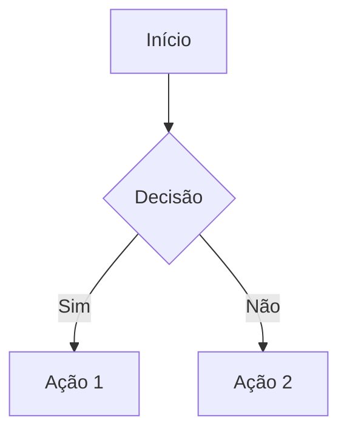

# Markdown Component

Renderizador de Markdown rico com suporte a tabelas, código, diagramas Mermaid e Monaco Editor inline.

## Features

- ✅ **Markdown completo** - Headings, listas, links, blockquotes, imagens
- ✅ **Tabelas** - Renderização correta com extração automática de blocos `markdown`
- ✅ **Código** - Syntax highlighting com botão de copiar
- ✅ **Mermaid** - Diagramas renderizados automaticamente
- ✅ **Monaco Editor** - Edição inline de código (modo interativo)
- ✅ **Copiar** - Botões para copiar código, tabelas (TSV, CSV, Excel)
- ✅ **Sanitização** - DOMPurify para segurança
- ✅ **Acessibilidade** - ARIA labels em blocos de código e tabelas
- ✅ **Theming** - CSS custom properties

## Instalação

```javascript
import { Markdown } from './components/markdown';
```

## Dependências

O componente depende de:

```bash
npm install markdown-it dompurify mermaid
# Monaco é carregado dinamicamente apenas quando necessário
```

## Uso Básico

```svelte
<script>
  import { Markdown } from './components/markdown';
  
  let content = `
# Título

Este é um parágrafo com **negrito** e *itálico*.

## Lista

- Item 1
- Item 2
- Item 3

## Código

\`\`\`javascript
function hello() {
  console.log('Hello, World!');
}
\`\`\`
  `;
</script>

<Markdown {content} />
```

## Props

| Prop | Tipo | Default | Descrição |
|------|------|---------|-----------|
| `content` | `string` | `''` | Conteúdo Markdown a ser renderizado |
| `interactiveButtons` | `boolean` | `false` | Se `true`, botões são focáveis e Monaco Editor é habilitado |

## Modo Interativo

Quando `interactiveButtons={true}`:

- Botões de copiar têm `tabindex="0"` (navegáveis por Tab)
- Blocos de código ganham botão "Editar" que abre Monaco Editor inline
- Tabelas ganham botão "Ver código" que mostra Markdown no Monaco
- Diagramas Mermaid ganham botão "Ver código" para edição

```svelte
<!-- Modo padrão: botões não focáveis (ideal para listas de mensagens) -->
<Markdown {content} />

<!-- Modo interativo: botões focáveis + Monaco Editor -->
<Markdown {content} interactiveButtons={true} />
```

## Tabelas

O componente processa tabelas de várias formas:

### Tabela Markdown padrão

```markdown
| Nome | Idade |
|------|-------|
| Ana  | 25    |
| Bob  | 30    |
```

### Tabela em bloco de código (LLMs fazem isso às vezes)

O componente detecta e extrai automaticamente:

````markdown
```markdown
| Nome | Idade |
|------|-------|
| Ana  | 25    |
```
````

### Botões de tabela

Cada tabela renderizada tem botões:

- **Copiar** - Copia como TSV (Tab-separated)
- **CSV** - Baixa arquivo CSV
- **Excel** - Copia HTML para colar em Excel/Google Sheets

## Código

Blocos de código são renderizados com:

- Detecção automática de linguagem
- Botão "Copiar" para copiar o código
- Botão "Editar" (modo interativo) para abrir Monaco Editor

```svelte
<Markdown content={`
\`\`\`python
def hello():
    print("Hello!")
\`\`\`
`} interactiveButtons={true} />
```

## Diagramas Mermaid

Diagramas Mermaid são renderizados automaticamente:

````markdown

````

## Estilização

O componente usa CSS custom properties:

```css
/* Cores */
--color-bg-tertiary      /* Fundo de código e tabelas */
--color-bg-secondary     /* Fundo alternado de linhas */
--color-border           /* Bordas */
--color-text-primary     /* Texto principal */
--color-text-secondary   /* Texto secundário */
--color-link             /* Links */
--color-accent           /* Destaques, botões hover */

/* Espaçamentos */
--spacing-xs             /* Padding pequeno */
--spacing-sm             /* Padding médio */
--spacing-md             /* Padding grande */

/* Tipografia */
--line-height            /* Altura de linha */
--font-size-sm           /* Tamanho de fonte pequeno */
--border-radius          /* Arredondamento */
```

### Exemplo de tema

```css
.my-container {
  --color-bg-tertiary: #1e1e1e;
  --color-bg-secondary: #252525;
  --color-border: #3d3d3d;
  --color-text-primary: #e6e6e6;
  --color-text-secondary: #a0a0a0;
  --color-link: #58a6ff;
  --color-accent: #58a6ff;
  --border-radius: 4px;
}
```

## Mensagens de Chat

O componente tem estilos especiais para mensagens do usuário:

```svelte
<div class="message user">
  <Markdown content={userMessage} />
</div>

<div class="message assistant">
  <Markdown content={assistantMessage} />
</div>
```

Quando dentro de `.message.user`, código e tabelas usam fundos mais claros (rgba branco).

## Acessibilidade

- Blocos de código têm `role="group"` e `aria-label` com a linguagem
- Tabelas têm `role="group"` e `aria-label="Tabela"`
- Diagramas Mermaid têm `role="group"` e `aria-label="Mermaid"`
- Botões têm `aria-label` descritivo
- Links externos têm `target="_blank"` e `rel="noopener noreferrer"`
- Links têm `tabindex="-1"` para não interferir na navegação por setas

## Monaco Editor

O Monaco Editor é carregado dinamicamente apenas quando o usuário clica em "Editar":

```javascript
const monaco = await import('monaco-editor');
editor = monaco.editor.create(container, {
  value: code,
  language: 'javascript',
  theme: 'vs-dark',
  accessibilitySupport: 'on',
  // ...
});
```

Características:
- Carregamento lazy (não afeta bundle inicial)
- Tema escuro
- Suporte a acessibilidade (`accessibilitySupport: 'on'`)
- Auto-layout quando container redimensiona

## Migração

Se você estava importando de `./components/Markdown.svelte`:

```javascript
// Antes
import Markdown from './components/Markdown.svelte';

// Depois
import { Markdown } from './components/markdown';
```

## Segurança

O conteúdo é sanitizado com DOMPurify:

- HTML raw é bloqueado (`html: false` no markdown-it)
- Apenas tags seguras são permitidas (p, a, code, table, etc.)
- Atributos são filtrados (href, src, alt, class, etc.)
- Links externos são forçados a abrir em nova aba


